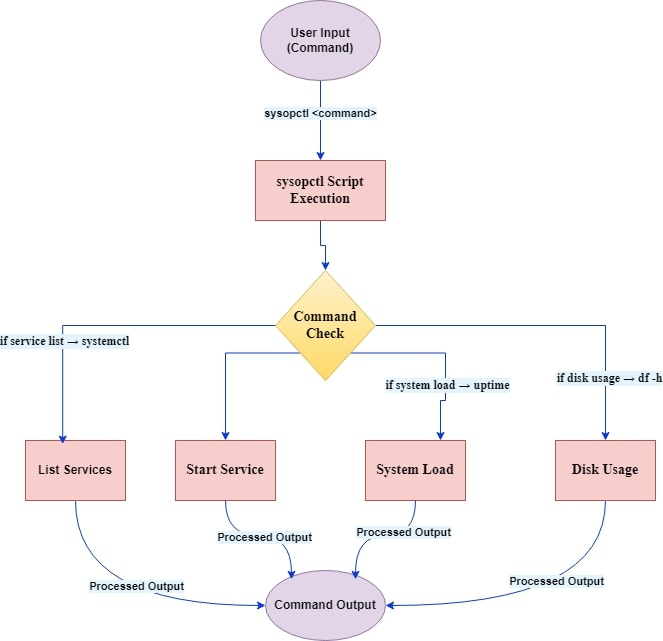
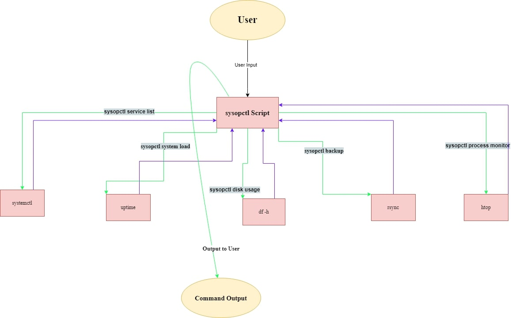

# Sysopctl: A Comprehensive System Monitoring and Management Tool

`sysopctl` is a powerful, Linux-based command-line tool designed to simplify and streamline system monitoring and management tasks. 

With an intuitive interface and modular design, `sysopctl` empowers system administrators to:
- Manage system services effectively.
- Monitor real-time system performance.
- Analyze logs to detect potential issues.
- Perform efficient backups of important files and directories.

This tool was crafted with usability and efficiency in mind, making it a must-have for any Linux administrator!

---
---

## Features

The `sysopctl` tool offers a wide range of features to help Linux administrators manage their systems efficiently. Here’s what it can do:

### 1. **Service Management**

- **List Running Services**:
    - Command:  
      ```bash
      sysopctl service list
      ```
    - Description:  
      Displays all active services on the system, making it easy to monitor what’s running.

- **Start a Service**:
    - Command:  
      ```bash
      sysopctl service start <service-name>
      ```
    - Example:  
      ```bash
      sysopctl service start apache2
      ```
    - Description:  
      Starts the specified service, ensuring critical services are operational.

- **Stop a Service**:
    - Command:  
      ```bash
      sysopctl service stop <service-name>
      ```
    - Example:  
      ```bash
      sysopctl service stop apache2
      ```
    - Description:  
      Stops a running service to free up system resources or troubleshoot issues.

---

### 2. **System Monitoring**

- **System Load**:
    - Command:  
      ```bash
      sysopctl system load
      ```
    - Description:  
      Displays system load averages over the past 1, 5, and 15 minutes, helping you monitor system performance.

- **Disk Usage**:
    - Command:  
      ```bash
      sysopctl disk usage
      ```
    - Description:  
      Provides detailed information about disk space usage in a human-readable format, enabling efficient disk space management.

---

### 3. **Process Monitoring**

- **Monitor Processes**:
    - Command:  
      ```bash
      sysopctl process monitor
      ```
    - Description:  
      Launches an interactive process monitor (`top`), providing real-time insights into running processes and resource consumption.

---

### 4. **Log Analysis**

- **Analyze System Logs**:
    - Command:  
      ```bash
      sysopctl logs analyze
      ```
    - Description:  
      Scans system logs to identify warnings, errors, or anomalies that may impact system stability.

---

### 5. **Backup Management**

- **Backup Files and Directories**:
    - Command:  
      ```bash
      sysopctl backup <source-path> <destination-path>
      ```
    - Example:  
      ```bash
      sysopctl backup /etc /backup
      ```
    - Description:  
      Utilizes `rsync` for efficient and reliable backups, ensuring important files and directories are secure.

---

### 6. **Help and Version Options**

- **Help**:
    - Command:  
      ```bash
      sysopctl --help
      ```
    - Description:  
      Displays usage instructions and examples for all commands.

- **Version**:
    - Command:  
      ```bash
      sysopctl --version
      ```
    - Description:  
      Outputs the current version of the `sysopctl` tool.

---
---

## System Workflow

The workflow of `sysopctl` demonstrates how commands are processed from user input to execution and output.

### Workflow Steps

1. **User Input**:
    - The user provides a command, such as:
      ```bash
      sysopctl service list
      ```
    - This input is processed by the script.

2. **Script Execution**:
    - The `sysopctl` script parses the input using `if-elif-else` logic to determine the correct command to execute.

3. **System Command**:
    - The script executes the appropriate Linux system command based on the user input:
        - For example, the command:
          ```bash
          sysopctl service list
          ```
          internally runs:
          ```bash
          systemctl list-units --type=service --state=running
          ```

4. **Output**:
    - The result of the system command is captured and displayed to the user in a readable format:
      ```plaintext
      UNIT                        LOAD   ACTIVE SUB     DESCRIPTION
      ssh.service                 loaded active running OpenBSD Secure Shell server
      apache2.service             loaded active running The Apache HTTP Server
      ```

---

### Workflow Diagram

The diagram below illustrates the entire process flow of the `sysopctl` tool:



### Example Flow

#### Example Command: `sysopctl system load`

- **Input**:
    ```bash
    sysopctl system load
    ```

- **Processing**:
    - The script identifies this as a `system load` command.
    - It internally runs:
      ```bash
      uptime
      ```

- **Output**:
    ```plaintext
     10:14:23 up 1 day,  5:32,  2 users,  load average: 0.42, 0.36, 0.31
    ```

---

### System Architecture

The architecture illustrates how `sysopctl` interacts with Linux tools and the user:



---
---
## Usage

The `sysopctl` tool provides an intuitive command-line interface for managing system resources and tasks. Below are the available commands and their usage examples.

---

### 1. **Service Management**

- **List Running Services**:  
    - Command:  
      ```bash
      ./sysopctl.sh service list
      ```
    - Description:  
      Displays all active services on the system.

- **Start a Service**:  
    - Command:  
      ```bash
      ./sysopctl.sh service start <service-name>
      ```
    - Example:  
      ```bash
      ./sysopctl.sh service start apache2
      ```
    - Description:  
      Starts the specified service to ensure it is operational.

- **Stop a Service**:  
    - Command:  
      ```bash
      ./sysopctl.sh service stop <service-name>
      ```
    - Example:  
      ```bash
      ./sysopctl.sh service stop apache2
      ```
    - Description:  
      Stops a running service to free up system resources or troubleshoot issues.

---

### 2. **System Monitoring**

- **System Load**:  
    - Command:  
      ```bash
      ./sysopctl.sh system load
      ```
    - Description:  
      Displays system load averages over the past 1, 5, and 15 minutes, helping you monitor system performance.

- **Disk Usage**:  
    - Command:  
      ```bash
      ./sysopctl.sh disk usage
      ```
    - Description:  
      Provides a detailed report of disk space usage in a human-readable format.

---

### 3. **Process Monitoring**

- **Monitor Processes**:  
    - Command:  
      ```bash
      ./sysopctl.sh process monitor
      ```
    - Description:  
      Launches the `top` utility to monitor processes and resource usage in real-time.

---

### 4. **Log Analysis**

- **Analyze System Logs**:  
    - Command:  
      ```bash
      ./sysopctl.sh logs analyze
      ```
    - Description:  
      Searches system logs for warnings, errors, and anomalies that may impact system stability.

---

### 5. **Backup Management**

- **Backup Files or Directories**:  
    - Command:  
      ```bash
      ./sysopctl.sh backup <source-path> <destination-path>
      ```
    - Example:  
      ```bash
      ./sysopctl.sh backup /etc /backup
      ```
    - Description:  
      Utilizes `rsync` to copy files or directories from the source to the destination efficiently.

---

### 6. **Help and Version**

- **Help**:  
    - Command:  
      ```bash
      ./sysopctl.sh --help
      ```
    - Description:  
      Displays usage instructions and examples for all available commands.

- **Version**:  
    - Command:  
      ```bash
      ./sysopctl.sh --version
      ```
    - Description:  
      Outputs the current version of the `sysopctl` tool.

---

### Sample Workflow

Here’s an example workflow using `sysopctl`:

1. **List all running services**:
    - Command:
      ```bash
      ./sysopctl.sh service list
      ```

2. **Check system load**:
    - Command:
      ```bash
      ./sysopctl.sh system load
      ```

3. **Backup configuration files**:
    - Command:
      ```bash
      ./sysopctl.sh backup /etc /backup
      ```

4. **Analyze system logs**:
    - Command:
      ```bash
      ./sysopctl.sh logs analyze
      ```

---
---
## Manual Page

The `sysopctl` tool includes a comprehensive manual page that users can access directly from their terminal to learn about the tool's commands and usage.

---

### **Accessing the Manual Page**

- **Command**:  
    ```bash
    man sysopctl
    ```
- **Description**:  
    Displays detailed documentation for `sysopctl`, including:
    - A description of the tool.
    - Available commands.
    - Usage examples.

---

### **Manual Page Content**

Below is a breakdown of the sections included in the `sysopctl` manual page:

- **NAME**:  
    - Description:  
      `sysopctl - A command-line tool for managing Linux system resources and tasks.`

- **SYNOPSIS**:  
    - Command format:  
      ```bash
      sysopctl [COMMAND] [OPTIONS]
      ```

- **DESCRIPTION**:  
    - Details the purpose of the tool, which is to simplify Linux system monitoring and administration tasks.

- **COMMANDS**:  
    - `service list`:  
      Displays all active services running on the system.
    - `service start <service-name>`:  
      Starts the specified service.
    - `service stop <service-name>`:  
      Stops the specified running service.
    - `system load`:  
      Displays system load averages over the past 1, 5, and 15 minutes.
    - `disk usage`:  
      Displays disk usage statistics in a human-readable format.
    - `process monitor`:  
      Launches an interactive process monitor to view system resource usage in real-time.
    - `logs analyze`:  
      Analyzes system logs for errors, warnings, and anomalies.
    - `backup <source-path> <destination-path>`:  
      Backs up files or directories using rsync.

- **EXAMPLES**:  
    - Example 1:  
      ```bash
      sysopctl service list
      ```
      Lists all running services.
    - Example 2:  
      ```bash
      sysopctl backup /etc /backup
      ```
      Backs up the `/etc` directory to `/backup`.

- **AUTHOR**:  
    - Written by [Your Name].

- **COPYRIGHT**:  
    - Copyright © 2024 [Your Name]. Licensed under the MIT License.

---

### **Adding the Manual Page to a System**

- **Step 1**: Copy the `sysopctl.1` file to the system manual directory:  
    ```bash
    sudo cp sysopctl.1 /usr/share/man/man1/
    ```

- **Step 2**: Update the manual page database:  
    ```bash
    sudo mandb
    ```

- **Step 3**: Test the manual page:  
    ```bash
    man sysopctl
    ```

---

### **Including the Manual Page in the Repository**

- Ensure that the `sysopctl.1` file is part of the repository. Recommended location:
    - Root of the repository, or
    - A dedicated `docs/` directory.
- Reference it in the project’s README file to guide users.

---

### **Usage Note**

For easy documentation access, instruct users to run:
```bash
man sysopctl


